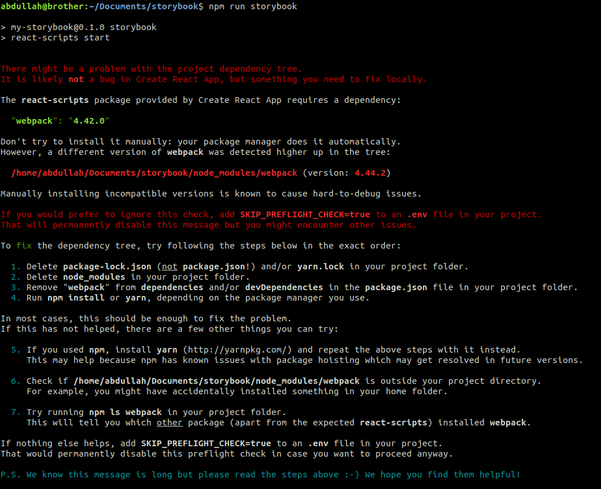

# storybook

Storybook is an open source tool for developing UI components in isolation. This is a V6 Storyboard is built in React. Check out the documentaion here [Create React App documentation](https://storybook.js.org/docs/react/get-started/install). Or refer [this tutorial.](https://www.youtube.com/playlist?list=PLC3y8-rFHvwhC-j3x3t9la8-GQJGViDQk)

### `npm run start`
Runs the storyboard in the development mode.
Open [http://localhost:6006/](http://localhost:6006/) to view it in the browser.

### `npm run storybook`
Runs the app in the development mode.\
Open [http://localhost:3000](http://localhost:3000) to view it in the browser.

To fix the issue that comes when you try `npm run storybook` do the following steps.
 